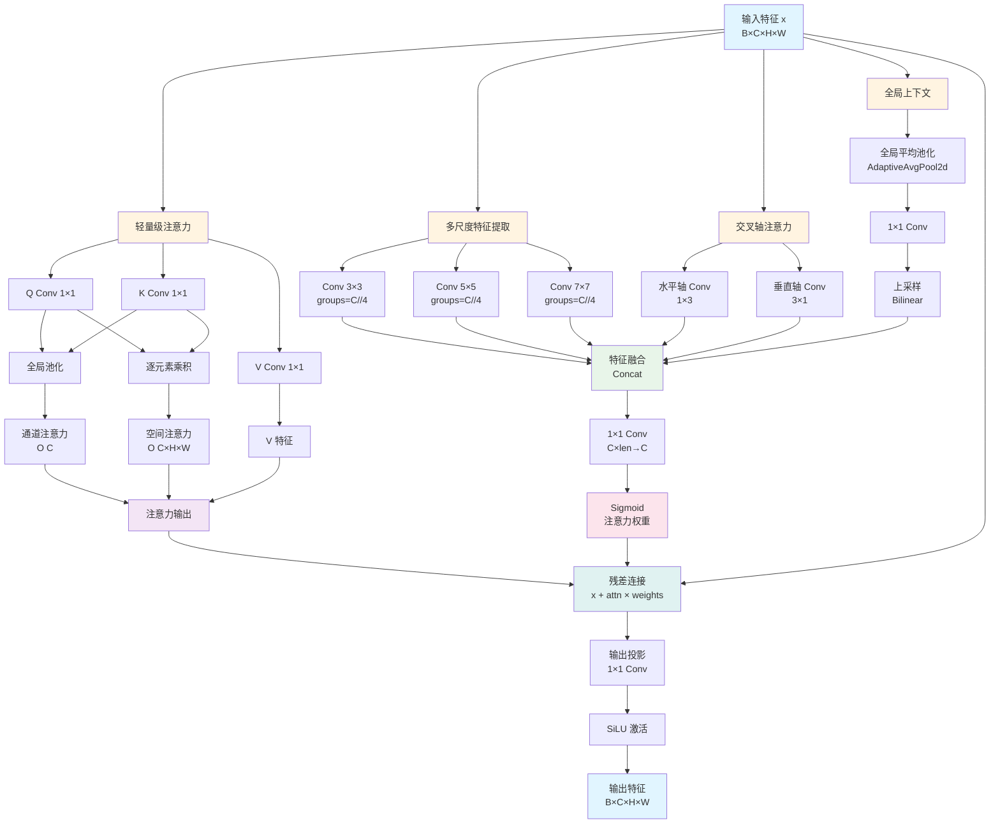
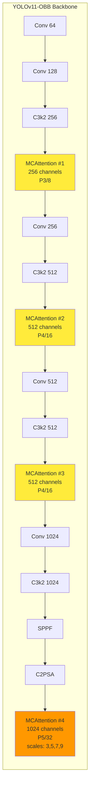

# MCAttention 模块结构图

## 模块整体架构



## 详细数据流图

### 1. 多尺度特征提取分支

```
输入 x [B, C, H, W]
    │
    ├─→ Conv2d(k=3, groups=C//4) ─→ Feature_3×3 [B, C, H, W]
    ├─→ Conv2d(k=5, groups=C//4) ─→ Feature_5×5 [B, C, H, W]
    └─→ Conv2d(k=7, groups=C//4) ─→ Feature_7×7 [B, C, H, W]
```

### 2. 交叉轴注意力分支

```
输入 x [B, C, H, W]
    │
    ├─→ Conv2d(k=(1,3)) ─→ Horizontal_Feature [B, C, H, W]
    └─→ Conv2d(k=(3,1)) ─→ Vertical_Feature   [B, C, H, W]
```

### 3. 全局上下文分支

```
输入 x [B, C, H, W]
    │
    └─→ AdaptiveAvgPool2d(1) ─→ [B, C, 1, 1]
         │
         └─→ Conv2d(1×1) ─→ [B, C, 1, 1]
              │
              └─→ Interpolate(H, W) ─→ Global_Feature [B, C, H, W]
```

### 4. 特征融合与权重生成

```
[Feature_3×3, Feature_5×5, Feature_7×7, 
 Horizontal_Feature, Vertical_Feature, Global_Feature]
    │
    └─→ Concat(dim=1) ─→ [B, C×(3+2+1), H, W] = [B, C×6, H, W]
         │
         └─→ Conv2d(1×1, C×6→C) ─→ [B, C, H, W]
              │
              └─→ Sigmoid ─→ Attention_Weights [B, C, H, W]
```

### 5. 轻量级注意力机制

```
输入 x [B, C, H, W]
    │
    ├─→ Q_Conv(1×1) ─→ Q [B, C, H, W]
    ├─→ K_Conv(1×1) ─→ K [B, C, H, W]
    └─→ V_Conv(1×1) ─→ V [B, C, H, W]

Q, K ─→ 通道注意力:
    ├─→ AdaptiveAvgPool2d(1) ─→ Q_pool, K_pool [B, C]
    └─→ Sum(Q_pool * K_pool) ─→ Sigmoid ─→ Channel_Attn [B, 1]

Q, K ─→ 空间注意力:
    └─→ (Q * K).sum(dim=1) / sqrt(C) ─→ Sigmoid ─→ Spatial_Attn [B, 1, H, W]

V, Channel_Attn, Spatial_Attn ─→ 结合:
    └─→ V * Spatial_Attn * Channel_Attn ─→ Attention_Output [B, C, H, W]
```

### 6. 最终输出

```
输入 x [B, C, H, W]
    │
    └─→ x + Attention_Output * Attention_Weights ─→ [B, C, H, W]
         │
         └─→ Out_Conv(1×1) ─→ [B, C, H, W]
              │
              └─→ SiLU ─→ 输出 [B, C, H, W]
```

## 模块在 YOLO Backbone 中的位置



## 计算复杂度对比

| 组件 | 原始设计 | 优化后 | 复杂度 |
|------|---------|--------|--------|
| 多尺度卷积 | 3个分组卷积 | 3个分组卷积 | O(C×H×W×K²) |
| 交叉轴注意力 | 2个卷积 | 2个卷积 | O(C×H×W) |
| 全局上下文 | 池化+卷积+上采样 | 池化+卷积+上采样 | O(C×H×W) |
| 特征融合 | 拼接+卷积 | 拼接+卷积 | O(C×H×W) |
| **空间注意力** | **O(H×W×H×W)** | **O(C×H×W)** | **大幅降低** |
| 通道注意力 | O(C) | O(C) | O(C) |

**总复杂度**：
- 原始：O(C×H×W) + O(H×W×H×W) ≈ O(H²×W²) （对于大特征图）
- 优化后：O(C×H×W) （线性复杂度）

## 参数数量估算

对于通道数 C=256 的 MCAttention 模块：

- 多尺度卷积：3 × (C²/4 × K²) ≈ 3 × (256²/4 × 25) ≈ 1.2M
- 交叉轴卷积：2 × (C² × 3) ≈ 2 × (256² × 3) ≈ 0.4M
- 全局上下文：C² ≈ 0.07M
- 特征融合：C × (6C) ≈ 0.4M
- Q/K/V 卷积：3 × C² ≈ 0.2M
- 输出投影：C² ≈ 0.07M

**总计**：约 2.3M 参数（对于 C=256）

## ASCII 结构图（简化版）

```
┌─────────────────────────────────────────────────────────────────┐
│                     MCAttention 模块结构                         │
└─────────────────────────────────────────────────────────────────┘

输入特征 x [B, C, H, W]
    │
    ├──────────────────────────────────────────────────────────┐
    │                                                          │
    ├──────────────────┬──────────────────┬───────────────────┤
    │                  │                  │                   │
    ▼                  ▼                  ▼                   ▼
┌─────────────┐  ┌─────────────┐  ┌─────────────┐  ┌─────────────────┐
│ 分支1:      │  │ 分支2:      │  │ 分支3:      │  │ 分支4:          │
│ 多尺度特征   │  │ 交叉轴注意力 │  │ 全局上下文   │  │ 轻量级注意力     │
├─────────────┤  ├─────────────┤  ├─────────────┤  ├─────────────────┤
│ Conv 3×3    │  │ Conv 1×3    │  │ GAP         │  │ Q_Conv (1×1)    │
│ Conv 5×5    │  │ Conv 3×1    │  │ 1×1 Conv    │  │ K_Conv (1×1)    │
│ Conv 7×7    │  │             │  │ Upsample    │  │ V_Conv (1×1)    │
│ (groups)    │  │             │  │             │  │                 │
└─────────────┘  └─────────────┘  └─────────────┘  │ 通道注意力       │
    │                  │                  │         │ 空间注意力       │
    │                  │                  │         └─────────────────┘
    │                  │                  │                   │
    └──────────────────┴──────────────────┘                   │
                      │                                       │
                      ▼                                       │
        ┌─────────────────────────────────────┐              │
        │  特征融合 (Concat)                   │              │
        │  [多尺度×3, 交叉轴×2, 全局]          │              │
        │  → [B, C×6, H, W]                   │              │
        └─────────────────────────────────────┘              │
                      │                                       │
                      ▼                                       │
        ┌─────────────────────────────────────┐              │
        │  1×1 Conv (C×6→C)                   │              │
        │  Sigmoid                             │              │
        └─────────────────────────────────────┘              │
                      │                                       │
                      ▼                                       │
              注意力权重 [B, C, H, W]                          │
                      │                                       │
                      │                                       │
                      └───────────────┬───────────────────────┘
                                      │
                                      ▼
                          ┌─────────────────────┐
                          │   相乘 (×)          │
                          │  attn × weights     │
                          └─────────────────────┘
                                      │
                                      │
                      ┌───────────────┴───────────────┐
                      │                               │
                      ▼                               ▼
              ┌───────────────┐              ┌───────────────┐
              │   残差连接     │              │   输入 x      │
              │  (Residual)   │              │  (Residual)   │
              └───────────────┘              └───────────────┘
                      │                               │
                      └───────────────┬───────────────┘
                                      │
                                      ▼
                          ┌─────────────────────┐
                          │   相加 (+)          │
                          │  x + attn×weights   │
                          └─────────────────────┘
                                      │
                                      ▼
                          ┌─────────────────────┐
                          │   输出投影           │
                          │   1×1 Conv          │
                          │   SiLU              │
                          └─────────────────────┘
                                      │
                                      ▼
                          输出特征 [B, C, H, W]
```

## 关键修正说明

**实际代码实现的关键点：**

1. **注意力权重生成**：由**所有分支**（多尺度×3 + 交叉轴×2 + 全局×1）融合后生成
   ```python
   fused_features = torch.cat(multi_scale_features + [h_feat, v_feat, global_feat], dim=1)
   attention_weights = self.attention_conv(fused_features)
   ```

2. **轻量级注意力**：**直接从输入 x 计算**，不依赖多尺度特征
   ```python
   q = self.q_conv(x)  # 直接从 x 计算
   k = self.k_conv(x)
   v = self.v_conv(x)
   ```

3. **最终融合**：`x + attn_output × attention_weights`

## 在 YOLO Backbone 中的位置（ASCII 图）

```
YOLOv11-OBB Backbone 结构：

原始版本：
Conv(64) → Conv(128) → C3k2(256) → Conv(256) → C3k2(512) 
→ Conv(512) → C3k2(512) → Conv(1024) → C3k2(1024) → SPPF → C2PSA

MCAttention 版本：
Conv(64) → Conv(128) → C3k2(256) 
    ↓
┌─────────────────────────────────────┐
│  MCAttention #1 (256 ch, P3/8)     │  ← 位置 3
└─────────────────────────────────────┘
    ↓
Conv(256) → C3k2(512)
    ↓
┌─────────────────────────────────────┐
│  MCAttention #2 (512 ch, P4/16)    │  ← 位置 6
└─────────────────────────────────────┘
    ↓
Conv(512) → C3k2(512)
    ↓
┌─────────────────────────────────────┐
│  MCAttention #3 (512 ch, P4/16)    │  ← 位置 9
└─────────────────────────────────────┘
    ↓
Conv(1024) → C3k2(1024) → SPPF → C2PSA
    ↓
┌─────────────────────────────────────┐
│  MCAttention #4 (1024 ch, P5/32)   │  ← 位置 14
│  scales: [3, 5, 7, 9]              │
└─────────────────────────────────────┘
```

## 数据流详细说明

```
输入: x [B, C, H, W]
  │
  ├─→ [分支1] 多尺度卷积 ─→ [F3, F5, F7] [B, C, H, W] × 3
  │
  ├─→ [分支2] 交叉轴卷积 ─→ [F_h, F_v] [B, C, H, W] × 2
  │
  ├─→ [分支3] 全局上下文 ─→ [F_global] [B, C, H, W]
  │
  └─→ [分支4] Q/K/V 卷积 ─→ [Q, K, V] [B, C, H, W] × 3
       │
       ├─→ 通道注意力: Q_pool, K_pool → Channel_Attn [B, 1]
       └─→ 空间注意力: (Q * K).sum() → Spatial_Attn [B, 1, H, W]

融合:
  [F3, F5, F7, F_h, F_v, F_global] → Concat → [B, C×6, H, W]
    │
    └─→ 1×1 Conv → Attention_Weights [B, C, H, W]

注意力输出:
  V × Spatial_Attn × Channel_Attn → Attention_Output [B, C, H, W]

最终输出:
  x + Attention_Output × Attention_Weights → Out_Conv → SiLU → 输出
```

