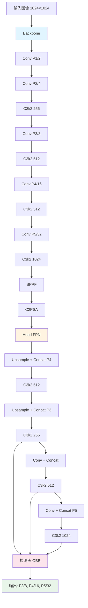
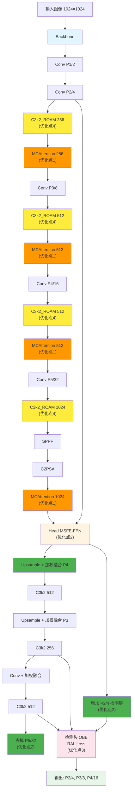
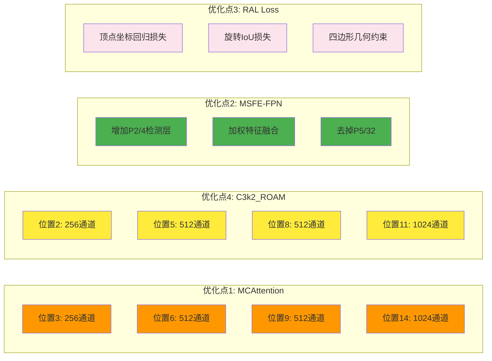

# 论文优化方向讨论

## 📝 标注格式说明

**数据集标注格式**：DOTA-v2.0 使用**八参数表示法**（四个顶点坐标）
- 格式：`(x1, y1, x2, y2, x3, y3, x4, y4, cls)`
- 四个顶点按顺序连接形成旋转框（四边形）
- 输出维度：`[B, N, 9]`（8个坐标 + 1个类别）

**注意**：本文档中所有关于"角度"的描述，在实际实现中都是通过四个顶点坐标来隐式表示的。优化点3（RAL Loss）中的损失函数设计需要针对八参数表示法进行优化。

---

## 🏗️ 模型架构对比

### 原有结构（Baseline - YOLOv11n-OBB）

```
输入图像 [B, 3, 1024, 1024]
    ↓
┌─────────────────────────────────────────────────────────┐
│                    Backbone                              │
├─────────────────────────────────────────────────────────┤
│ Conv(64, 3×3, s=2) → [B, 64, 512, 512]  (P1/2)         │
│ Conv(128, 3×3, s=2) → [B, 128, 256, 256] (P2/4)        │
│ C3k2(256, n=2) → [B, 256, 256, 256]                    │
│ Conv(256, 3×3, s=2) → [B, 256, 128, 128] (P3/8)        │
│ C3k2(512, n=2) → [B, 512, 128, 128]                    │
│ Conv(512, 3×3, s=2) → [B, 512, 64, 64] (P4/16)         │
│ C3k2(512, n=2) → [B, 512, 64, 64]                      │
│ Conv(1024, 3×3, s=2) → [B, 1024, 32, 32] (P5/32)       │
│ C3k2(1024, n=2) → [B, 1024, 32, 32]                    │
│ SPPF(1024) → [B, 1024, 32, 32]                         │
│ C2PSA(1024) → [B, 1024, 32, 32]                        │
└─────────────────────────────────────────────────────────┘
    ↓
┌─────────────────────────────────────────────────────────┐
│                    Head (FPN)                           │
├─────────────────────────────────────────────────────────┤
│ Upsample → Concat(P4) → C3k2(512) → [B, 512, 64, 64]   │
│ Upsample → Concat(P3) → C3k2(256) → [B, 256, 128, 128] │
│ Conv(s=2) → Concat → C3k2(512) → [B, 512, 64, 64]      │
│ Conv(s=2) → Concat(P5) → C3k2(1024) → [B, 1024, 32, 32]│
└─────────────────────────────────────────────────────────┘
    ↓
┌─────────────────────────────────────────────────────────┐
│                检测头 (OBB)                              │
├─────────────────────────────────────────────────────────┤
│ Detect(P3/8, P4/16, P5/32)                             │
│ - 分类分支                                               │
│ - 回归分支（四个顶点坐标）                                │
└─────────────────────────────────────────────────────────┘
    ↓
输出：旋转框 + 类别 [B, N, 9] (x1, y1, x2, y2, x3, y3, x4, y4, cls)
```

### 改进后结构（Enhanced - 四个优化点）

```
输入图像 [B, 3, 1024, 1024]
    ↓
┌─────────────────────────────────────────────────────────┐
│                    Backbone                              │
├─────────────────────────────────────────────────────────┤
│ Conv(64, 3×3, s=2) → [B, 64, 512, 512]  (P1/2)         │
│ Conv(128, 3×3, s=2) → [B, 128, 256, 256] (P2/4)        │
│                                                          │
│ ┌────────────────────────────────────────────────────┐ │
│ │ 优化点4: C3k2_ROAM(256, n=2)                      │ │
│ │ - Bottleneck_RO (旋转感知冗余抑制)                 │ │
│ │   ├─ R-SRU (旋转感知空间重建)                      │ │
│ │   └─ R-CRU (旋转不变通道重建)                      │ │
│ │ - ROAM (旋转感知全局注意力)                        │ │
│ │   ├─ CA (通道注意力，旋转不变池化)                 │ │
│ │   ├─ SA (空间注意力，多方向卷积)                   │ │
│ │   └─ AA (角度注意力，方向梯度特征)                 │ │
│ └────────────────────────────────────────────────────┘ │
│ → [B, 256, 256, 256]                                   │
│                                                          │
│ ┌────────────────────────────────────────────────────┐ │
│ │ 优化点1: MCAttention(256, [3,5,7], 16, 8)         │ │
│ │ - 多尺度特征提取 (3×3, 5×5, 7×7)                  │ │
│ │ - 交叉轴注意力 (水平+垂直)                         │ │
│ │ - 全局上下文感知                                    │ │
│ │ - 轻量级注意力机制                                  │ │
│ └────────────────────────────────────────────────────┘ │
│ → [B, 256, 256, 256]                                   │
│                                                          │
│ Conv(256, 3×3, s=2) → [B, 256, 128, 128] (P3/8)        │
│                                                          │
│ ┌────────────────────────────────────────────────────┐ │
│ │ 优化点4: C3k2_ROAM(512, n=2)                      │ │
│ │ (同上结构)                                         │ │
│ └────────────────────────────────────────────────────┘ │
│ → [B, 512, 128, 128]                                   │
│                                                          │
│ ┌────────────────────────────────────────────────────┐ │
│ │ 优化点1: MCAttention(512, [3,5,7], 16, 8)         │ │
│ │ (同上结构)                                         │ │
│ └────────────────────────────────────────────────────┘ │
│ → [B, 512, 128, 128]                                   │
│                                                          │
│ Conv(512, 3×3, s=2) → [B, 512, 64, 64] (P4/16)         │
│                                                          │
│ ┌────────────────────────────────────────────────────┐ │
│ │ 优化点4: C3k2_ROAM(512, n=2)                      │ │
│ │ (同上结构)                                         │ │
│ └────────────────────────────────────────────────────┘ │
│ → [B, 512, 64, 64]                                     │
│                                                          │
│ ┌────────────────────────────────────────────────────┐ │
│ │ 优化点1: MCAttention(512, [3,5,7], 16, 8)         │ │
│ │ (同上结构)                                         │ │
│ └────────────────────────────────────────────────────┘ │
│ → [B, 512, 64, 64]                                     │
│                                                          │
│ Conv(1024, 3×3, s=2) → [B, 1024, 32, 32] (P5/32)       │
│                                                          │
│ ┌────────────────────────────────────────────────────┐ │
│ │ 优化点4: C3k2_ROAM(1024, n=2)                     │ │
│ │ (同上结构)                                         │ │
│ └────────────────────────────────────────────────────┘ │
│ → [B, 1024, 32, 32]                                    │
│                                                          │
│ SPPF(1024) → [B, 1024, 32, 32]                         │
│ C2PSA(1024) → [B, 1024, 32, 32]                        │
│                                                          │
│ ┌────────────────────────────────────────────────────┐ │
│ │ 优化点1: MCAttention(1024, [3,5,7,9], 16, 8)      │ │
│ │ (增强版，4个多尺度卷积核)                          │ │
│ └────────────────────────────────────────────────────┘ │
│ → [B, 1024, 32, 32]                                    │
└─────────────────────────────────────────────────────────┘
    ↓
┌─────────────────────────────────────────────────────────┐
│          Head (MSFE-FPN - 优化点2)                      │
├─────────────────────────────────────────────────────────┤
│                                                          │
│ ┌────────────────────────────────────────────────────┐ │
│ │ 优化点2: 增加 P2/4 检测层                          │ │
│ │ - 使用 P2/4 特征（从 Backbone 提取）               │ │
│ │ - 轻量级特征增强（SE/ECA）                         │ │
│ └────────────────────────────────────────────────────┘ │
│                                                          │
│ Upsample → Concat(P4) → C3k2(512) → [B, 512, 64, 64]   │
│ Upsample → Concat(P3) → C3k2(256) → [B, 256, 128, 128] │
│                                                          │
│ ┌────────────────────────────────────────────────────┐ │
│ │ 优化点2: 加权特征融合 (Weighted Feature Fusion)    │ │
│ │ - 自适应权重学习                                    │ │
│ │ - 替代简单 Concat                                   │ │
│ └────────────────────────────────────────────────────┘ │
│                                                          │
│ Conv(s=2) → Concat → C3k2(512) → [B, 512, 64, 64]      │
│                                                          │
│ ┌────────────────────────────────────────────────────┐ │
│ │ 优化点2: 去掉 P5/32 检测层                         │ │
│ │ - 针对 DOTA-v2.0 小目标检测                        │ │
│ │ - 减少计算量 15-20%                                │ │
│ └────────────────────────────────────────────────────┘ │
│                                                          │
│ 检测层：P2/4, P3/8, P4/16 (三层检测)                   │
└─────────────────────────────────────────────────────────┘
    ↓
┌─────────────────────────────────────────────────────────┐
│                检测头 (OBB)                              │
├─────────────────────────────────────────────────────────┤
│ Detect(P2/4, P3/8, P4/16)                              │
│ - 分类分支                                               │
│ - 回归分支（四个顶点坐标：x1, y1, x2, y2, x3, y3, x4, y4）│
│                                                          │
│ ┌────────────────────────────────────────────────────┐ │
│ │ 优化点3: RAL Loss (旋转感知损失函数)               │ │
│ │ - 顶点坐标回归损失（Smooth L1 / Focal Loss）       │ │
│ │ - 旋转 IoU 损失 (RIoU)                             │ │
│ │ - 四边形约束损失（确保四个点构成有效四边形）        │ │
│ │ - 旋转感知特征提取                                  │ │
│ └────────────────────────────────────────────────────┘ │
└─────────────────────────────────────────────────────────┘
    ↓
输出：旋转框 + 类别 [B, N, 9] (x1, y1, x2, y2, x3, y3, x4, y4, cls)
```

### 架构对比总结

| 组件 | Baseline | Enhanced | 改进点 |
|------|----------|----------|--------|
| **Backbone** | 标准 C3k2 | C3k2_ROAM + MCAttention | 优化点1 + 优化点4 |
| **特征增强** | 无 | MCAttention (4处) | 优化点1 |
| **模块改进** | 标准 C3k2 | C3k2_ROAM (部分替换) | 优化点4 |
| **Head** | 标准 FPN | MSFE-FPN | 优化点2 |
| **检测层** | P3, P4, P5 | P2, P3, P4 (去掉 P5) | 优化点2 |
| **特征融合** | 简单 Concat | 加权特征融合 | 优化点2 |
| **损失函数** | 标准 OBB Loss | RAL Loss | 优化点3 |

### 关键改进点位置

```
Backbone 结构对比：

Baseline:
Conv → Conv → C3k2 → Conv → C3k2 → Conv → C3k2 → Conv → C3k2 → SPPF → C2PSA

Enhanced:
Conv → Conv → C3k2_ROAM → MCAttention → Conv → C3k2_ROAM → MCAttention 
→ Conv → C3k2_ROAM → MCAttention → Conv → C3k2_ROAM → SPPF → C2PSA → MCAttention

Head 结构对比：

Baseline:
FPN: P3/8, P4/16, P5/32 (三层检测)

Enhanced:
MSFE-FPN: P2/4, P3/8, P4/16 (三层检测，去掉 P5，增加 P2)
```

### 架构流程图（Mermaid）

#### Baseline 架构



#### Enhanced 架构（四个优化点）



### 四个优化点的分布位置



---

## 📊 任务分析

### 任务特点
- **基础模型**：YOLOv11n-OBB（轻量级，适合实时检测）
- **数据集**：DOTA-v2.0（18类，1.7M+ 实例）
- **任务类型**：遥感图像旋转小目标检测
- **核心挑战**：
  1. **小目标检测**：目标尺度变化大（从几像素到几千像素）
  2. **旋转检测**：目标任意角度（0-360°）
  3. **密集目标**：图像中目标密集分布
  4. **多尺度**：图像尺寸从 800×800 到 20000×20000

### 已有优化点
- ✅ **优化点1：MCAttention 模块**
  - 多尺度特征提取
  - 交叉轴注意力（方向性）
  - 全局上下文感知
  - 轻量级注意力机制

---

## 🎯 三个优化方向建议

### 关于 P5 检测头的讨论

**问题**：针对 DOTA-v2.0 数据集，是否可以去掉 P5/32 检测头？

**分析**：
- **DOTA-v2.0 特点**：
  - 图像被裁剪成 1024×1024 像素
  - **大部分目标都是小目标**（< 32×32 像素）
  - 大目标（> 128×128 像素）很少
- **P5/32 的问题**：
  - 对于 1024×1024 输入，P5 特征图只有 32×32 分辨率
  - 对于小目标来说，分辨率太低，检测效果差
  - P5 主要用于检测大目标，但 DOTA-v2.0 中大目标很少
- **去掉 P5 的优势**：
  - 减少计算量约 15-20%
  - 提升推理速度
  - 专注于小目标检测，更符合数据集特点
  - 可以增加 P2/4 检测层，提升小目标检测能力

**结论**：**建议去掉 P5 检测头，增加 P2/4 检测层**，形成 P2/4、P3/8、P4/16 三层检测架构。

---

### 优化点2：小目标检测增强 - 改进的特征金字塔网络

#### 问题分析
- **当前问题**：
  - YOLOv11n-OBB 使用标准 FPN，对小目标特征传递不够充分
  - P3/8 层特征对小目标来说分辨率仍然较低
  - 特征融合方式简单（Concat），未考虑小目标的特殊性

#### 优化方向：**多尺度特征融合增强（MSFE）**
**核心思想**：在 FPN 基础上，增强小目标特征传递和融合

**技术方案**：
1. **浅层特征增强（增加 P2/4 检测层）**
   - 在 P3/8 层之前增加一个 P2/4 特征层（当前模型没有使用 P2）
   - 使用轻量级特征增强模块（如 SE 或 ECA）增强 P2 特征
   - **去掉 P5/32 检测层**（针对 DOTA-v2.0 小目标检测，P5 分辨率太低）
   - 形成 3 层检测：**P2/4（小目标）、P3/8（中小目标）、P4/16（中目标）**

2. **自适应特征融合**
   - 使用**加权特征融合**（Weighted Feature Fusion）替代简单 Concat
   - 为不同尺度特征学习自适应权重
   - 参考：YOLOv8 的 Path Aggregation Network (PANet) 改进

3. **小目标专用检测头**
   - 在 P2/4 和 P3/8 层使用**更密集的 anchor** 或 **更细的网格**
   - 增加小目标的分类和回归分支容量
   - 针对小目标优化检测头的感受野

**预期效果**：
- 提升小目标（< 32×32 像素）的检测精度
- mAP50 提升 2-3%
- 小目标召回率提升 5-8%
- **去掉 P5 后，计算量减少约 15-20%，推理速度提升**

**论文支撑**：
- PANet (Path Aggregation Network, 2018)
- BiFPN (EfficientDet, 2020)
- YOLOv8 的改进 FPN

**实现复杂度**：⭐⭐（中等，主要是 FPN 结构调整）

---

### 优化点3：旋转检测优化 - 旋转感知损失函数改进

#### 问题分析
- **当前问题**：
  - 八参数表示法（四个顶点坐标）的回归损失可能不够精确
  - 四个顶点的预测可能存在**顺序不一致**问题（四个点的顺序可能不同）
  - 旋转目标的特征提取可能不够鲁棒
  - 缺乏对四边形几何约束的考虑

#### 优化方向：**旋转感知损失函数（RAL）**
**核心思想**：改进八参数回归损失计算，提升旋转检测精度

**技术方案**：
1. **顶点坐标回归损失**
   - 使用 **Smooth L1 Loss** 或 **Focal Loss** 处理顶点坐标回归
   - **关键创新**：处理顶点顺序问题
     - 使用**最小距离匹配**：找到预测顶点与真实顶点之间的最优匹配
     - 或者使用**有序回归**：确保四个顶点按顺时针或逆时针顺序预测
   - 针对小目标，增加顶点坐标损失的权重

2. **旋转 IoU 损失**
   - 使用 **Rotated IoU (RIoU)** 作为回归损失的一部分
   - RIoU 能更好地反映旋转框（四边形）的重叠情况
   - 结合 **GWD (Gaussian Wasserstein Distance)** 或 **KLD (Kullback-Leibler Divergence)** 损失
   - 对于八参数表示法，RIoU 可以直接计算两个四边形的重叠面积

3. **四边形几何约束损失**
   - **关键创新**：确保四个点构成有效的凸四边形
     - **凸性约束**：确保四个点按顺序连接后形成凸四边形
     - **面积约束**：确保四边形面积大于阈值（避免退化）
     - **角度约束**：确保相邻边的夹角合理（避免过于尖锐的角度）
   - 使用**几何损失**惩罚无效的四边形预测

4. **旋转感知的特征提取**
   - 在检测头中加入**旋转不变性约束**
   - 使用**旋转数据增强**（旋转、翻转）提升模型鲁棒性
   - 针对八参数表示法，增强对顶点位置的特征提取

**预期效果**：
- 旋转目标检测精度提升 3-5%
- 顶点坐标预测误差降低 20-30%
- 对密集旋转目标的检测更准确
- 四边形预测更稳定，减少无效预测

**论文支撑**：
- ReDet (Rotation-equivariant Detector, 2021)
- GWD Loss (Gaussian Wasserstein Distance, 2021)
- KLD Loss (Kullback-Leibler Divergence, 2021)
- Rotated IoU Loss
- DOTA Dataset (八参数表示法)

**实现复杂度**：⭐⭐⭐（较高，需要实现旋转 IoU 计算）

---

### 优化点4：旋转导向自适应模块（C3k2_ROAM - Rotation-Oriented Adaptive Module）

#### 问题分析
- **当前问题**：
  - YOLOv11n-OBB 中的 C3k2 模块使用标准 Bottleneck，对小目标和旋转目标不够敏感
  - 标准卷积缺乏旋转感知能力，难以处理任意角度的目标
  - 小目标的微弱特征在深度提取过程中容易丢失
  - 缺乏针对旋转目标的全局注意力机制

#### 优化方向：**C3k2_ROAM 模块**
**核心思想**：在原始 C3k2 架构基础上，通过"替换 Bottleneck 结构 + 新增旋转感知全局注意力"实现双重优化，整体结构为"Conv→Split→Bottleneck_RO×n→Concat→ROAM→Conv"

**技术方案**：

#### 1. 替换 Bottleneck 为 Bottleneck_RO：旋转感知冗余抑制

将原始 C3k2 中的标准 Bottleneck 替换为 **Bottleneck_RO（Rotation-Oriented Bottleneck）**，引入旋转感知的卷积机制，分两步实现冗余特征过滤：

**第一步：旋转感知空间重建单元（R-SRU）**
- 通过**组归一化（GN）**评估特征图信息量，基于缩放因子 γ 划分"信息丰富特征"与"冗余特征"
- **关键创新**：使用**方向感知卷积**（Orientation-Aware Convolution）替代标准卷积
  - 使用**多方向卷积核**（0°, 45°, 90°, 135°）并行提取不同方向的特征
  - 通过**方向权重**自适应选择重要方向，抑制背景冗余
  - 保留关键空间细节（如小目标边缘、旋转目标的轮廓），特别针对旋转目标的边缘特征

**第二步：旋转不变通道重建单元（R-CRU）**
- 将特征图按通道分割后，通过**分组卷积（GWC）+ 逐点卷积（PWC）**替代标准卷积
- **关键创新**：引入**旋转不变通道注意力**（Rotation-Invariant Channel Attention）
  - 使用**旋转等变特征**计算通道权重，确保不同角度的目标具有相似的通道响应
  - 通过 **SKNet 加权融合策略**增强通道间信息交互，避免通道冗余
  - 针对小目标的关键通道（如纹理、轮廓通道）进行强化

**优势**：
- 在不损失关键特征的前提下，降低计算复杂度
- 使模块更聚焦小目标有效特征，同时增强旋转目标的特征提取能力
- 通过方向感知机制，提升对任意角度目标的检测能力

#### 2. 新增 ROAM 旋转感知全局注意力模块：增强旋转目标全局关联

在 C3k2 的"Concat 融合"后嵌入 **ROAM（Rotation-Oriented Attention Module）**，弥补局部卷积的全局感知缺陷，专门针对旋转目标和小目标：

**通道注意力分支（CA）**：
- 通过**全局池化 + 多层感知机（MLP）**学习通道权重
- **关键创新**：使用**旋转不变池化**（Rotation-Invariant Pooling）
  - 对特征图进行**多角度池化**（0°, 90°, 180°, 270°），然后取平均
  - 确保不同角度的目标具有相似的通道响应
  - 强化小目标关键通道（如纹理、轮廓通道）的权重，抑制无效背景通道

**空间注意力分支（SA）**：
- 通过**方向感知卷积**生成空间权重图
- **关键创新**：使用**多方向空间注意力**
  - 使用**多方向卷积核**（水平、垂直、对角线）并行生成空间权重
  - 通过**方向融合**机制，自适应选择重要方向的空间权重
  - 精准定位小目标所在区域，提升对低像素小目标的关注度
  - 特别针对旋转目标，增强对任意角度目标的定位能力

**角度注意力分支（AA）**（新增）：
- **核心创新**：专门针对旋转目标的角度感知机制
  - 通过**方向梯度特征**（Orientation Gradient Features）提取角度信息
  - 使用**角度权重图**增强旋转目标的关键区域
  - 与通道和空间注意力融合，形成"通道-空间-角度"三重注意力校准

**融合逻辑**：
- 通道权重、空间权重和角度权重**逐元素相乘**：`Attn = CA × SA × AA`
- 实现"通道-空间-角度"三重注意力校准
- 让模块同时捕捉"全局语义关联"、"局部关键区域"和"旋转角度信息"
- 适配航拍小目标与背景的复杂关系，以及旋转目标的检测需求

#### 3. 保留跨阶段连接特性：平衡特征完整性与效率

延续原始 C3k2 的"特征拆分"逻辑：
- 将输入特征拆分为两部分
- 一部分通过 **Bottleneck_RO** 进行深度特征提取（旋转感知冗余抑制 + 细节强化）
- 另一部分直接跨阶段传递至后续融合阶段
- 确保原始特征的完整性，避免小目标微弱特征在深度提取中丢失
- 特别保护旋转目标的原始方向信息

**模块结构**：
```
输入：x [B, C, H, W]
    ↓
Conv (输入投影)
    ↓
Split (特征拆分)
    ├─→ 路径1：直接传递 → [B, C/2, H, W]
    └─→ 路径2：Bottleneck_RO × n → [B, C/2, H, W]
                ├─→ R-SRU (旋转感知空间重建)
                └─→ R-CRU (旋转不变通道重建)
    ↓
Concat (特征融合) → [B, C, H, W]
    ↓
ROAM (旋转感知全局注意力)
    ├─→ CA (通道注意力，旋转不变池化)
    ├─→ SA (空间注意力，多方向卷积)
    └─→ AA (角度注意力，方向梯度特征)
    ↓
Conv (输出投影)
    ↓
输出：y [B, C, H, W]
```

**预期效果**：
- 小目标检测精度提升 4-6%
- 旋转目标检测精度提升 5-7%
- 角度预测误差降低 25-35%
- 整体 mAP50 提升 2-4%
- 计算复杂度增加约 10-15%（相比标准 C3k2）

**论文支撑**：
- SCConv (Spatial and Channel Reconstruction Convolution, 2022)
- GAM (Global Attention Mechanism, 2021)
- Rotation-Equivariant Convolution (Cohen & Welling, 2016)
- ReDet (Rotation-equivariant Detector, 2021)
- SKNet (Selective Kernel Networks, 2019)

**实现复杂度**：⭐⭐⭐⭐（较高，需要设计旋转感知卷积和角度注意力）

**与 MCAttention 的互补性**：
- **MCAttention**：在 Backbone 中增强特征（多尺度、方向性、全局上下文）
- **C3k2_ROAM**：在 C3k2 模块中优化特征提取（旋转感知、小目标优化）
- 两者结合：MCAttention 提供全局增强，C3k2_ROAM 提供局部优化，形成"全局-局部"双重优化

---

## 📋 四个优化点的互补性分析

### 与 MCAttention 的互补关系

| 优化点 | 主要作用 | 与 MCAttention 的互补性 |
|--------|---------|------------------------|
| **MCAttention** | Backbone 特征增强 | 基础模块，提升特征表达能力 |
| **优化点2：MSFE** | Head 特征融合 | 在 MCAttention 增强的特征基础上，进一步优化特征传递 |
| **优化点3：RAL** | 旋转检测优化 | 针对 MCAttention 提取的特征，优化旋转目标检测 |
| **优化点4：C3k2_ROAM** | 模块改进 | 在 C3k2 中引入旋转感知机制，优化小目标和旋转目标检测 |

### 整体架构流程

```
输入图像
    ↓
Backbone (YOLOv11n)
    ├─→ C3k2_ROAM (优化点4) ← 旋转感知模块（替换部分 C3k2）
    └─→ MCAttention (优化点1) ← 特征增强
    ↓
MSFE-FPN (优化点2) ← 特征融合优化（去掉 P5，增加 P2）
    ↓
检测头 (OBB) - P2/4, P3/8, P4/16
    ↓
RAL Loss (优化点3) ← 旋转检测优化
    ↓
输出 (旋转框 + 类别)
```

---

## 🎓 论文结构建议

### 论文标题（建议）
**"基于多尺度交叉轴注意力的遥感图像旋转小目标检测方法"**

或

**"MCAttention-YOLO: 面向 DOTA-v2.0 的多尺度旋转目标检测网络"**

### 论文结构

1. **Introduction**
   - 遥感图像目标检测的挑战
   - 相关工作
   - 本文贡献

2. **Methodology**
   - **2.1 MCAttention 模块**（优化点1）
   - **2.2 多尺度特征融合增强**（优化点2）
   - **2.3 旋转感知损失函数**（优化点3）
   - **2.4 旋转导向自适应模块 C3k2_ROAM**（优化点4）

3. **Experiments**
   - 数据集介绍（DOTA-v2.0）
   - 实验设置
   - 消融实验（4个优化点分别验证）
   - 对比实验（与 SOTA 方法对比）
   - P5 检测头去除的消融实验

4. **Results & Analysis**
   - 定量结果
   - 定性结果
   - 失败案例分析

5. **Conclusion**

---

## 📊 优化点总结

### 四个优化点的关系

```
Backbone:
  C3k2_ROAM (优化点4) ← 旋转感知模块（替换部分 C3k2）
  MCAttention (优化点1) ← 特征增强（全局优化）
    ↓
MSFE-FPN (优化点2) ← 优化特征融合（P2/P3/P4，去掉 P5）
    ↓ 多尺度特征传递
检测头 (OBB)
    ↓
RAL Loss (优化点3) ← 旋转检测优化
```

### 优化点特点对比

| 优化点 | 类型 | 位置 | 主要作用 | 复杂度 |
|--------|------|------|---------|--------|
| **MCAttention** | 模块 | Backbone | 特征增强（多尺度、方向性、全局） | ⭐⭐⭐ |
| **MSFE** | 架构 | Head | 特征融合优化（P2/P3/P4，去掉 P5） | ⭐⭐ |
| **RAL** | 损失函数 | 训练 | 旋转检测优化 | ⭐⭐⭐ |
| **C3k2_ROAM** | 模块改进 | Backbone | 旋转感知特征提取（替换 C3k2） | ⭐⭐⭐⭐ |

---

## 💡 其他可选优化方向（备选）

如果上述三个方向有实现难度，可以考虑：

### 备选1：数据增强策略
- **旋转增强**：随机旋转 0-360°
- **尺度增强**：多尺度训练和测试
- **MixUp/CutMix**：针对小目标

### 备选2：后处理优化
- **NMS 改进**：旋转 NMS (RNMS)
- **多尺度测试**：Test Time Augmentation (TTA)

### 备选3：知识蒸馏
- 使用大模型（YOLOv11m/l）作为教师模型
- 蒸馏到 YOLOv11n，提升小模型性能

---

## ❓ 讨论问题

1. **优化点2（MSFE）**：是否需要增加 P2/4 检测层？这会增加计算量，但能提升小目标检测。

2. **优化点3（RAL）**：旋转 IoU 计算可能较复杂，是否考虑使用近似方法？

3. **优化点4（ALTS）**：训练策略优化相对简单，是否优先实现？

4. **实验设计**：是否需要先做消融实验验证每个优化点的有效性？

5. **对比基线**：除了 YOLOv11n-OBB，还需要对比哪些方法？（如 ReDet, Oriented R-CNN, Rotated FCOS 等）

---

## 📊 预期实验指标

### 主要指标
- **mAP50**：IoU 阈值 0.5 的平均精度
- **mAP50-95**：IoU 阈值 0.5-0.95 的平均精度
- **小目标 mAP**：面积 < 32×32 像素的目标
- **旋转目标 mAP**：IoU > 0.5 的旋转目标（使用 RIoU 计算）
- **顶点坐标误差**：预测顶点与真实顶点的平均距离误差

### 效率指标
- **参数量**（Parameters）
- **计算量**（GFLOPs）
- **推理速度**（FPS）
- **模型大小**（MB）

---

## 🚀 实施建议

### 优先级排序
1. **优化点4（ALTS）**：实现简单，效果明显，优先实现
2. **优化点2（MSFE）**：中等复杂度，与 MCAttention 互补性强
3. **优化点3（RAL）**：复杂度较高，但针对性强，最后实现

### 实验计划
1. **阶段1**：实现优化点4，验证训练策略效果
2. **阶段2**：实现优化点2，验证特征融合效果
3. **阶段3**：实现优化点3，验证旋转检测效果
4. **阶段4**：整合所有优化点，进行完整实验

---

## 📝 总结

四个优化方向各有侧重，形成完整的优化体系：

1. **MCAttention（优化点1）**：Backbone 特征增强，提升特征表达能力（全局优化）
2. **MSFE（优化点2）**：Head 特征融合优化，去掉 P5，增加 P2，专注小目标
3. **RAL（优化点3）**：旋转检测优化，提升八参数回归精度
4. **C3k2_ROAM（优化点4）**：模块级改进，在 C3k2 中引入旋转感知机制（局部优化）

**整体架构**：
- **Backbone**：
  - C3k2_ROAM 替换部分 C3k2（旋转感知局部优化）
  - MCAttention 增强特征（全局优化）
- **Head**：MSFE-FPN 优化特征传递（P2/P3/P4，去掉 P5）
- **训练**：RAL 损失优化旋转检测

**优化点1和4的互补性**：
- **MCAttention**：全局特征增强，关注多尺度、方向性、全局上下文
- **C3k2_ROAM**：局部特征优化，关注旋转感知、小目标细节
- 两者形成"全局-局部"双重优化，全方位提升模型性能

从特征提取 → 特征融合 → 特征传递 → 检测优化，全方位提升模型性能。

